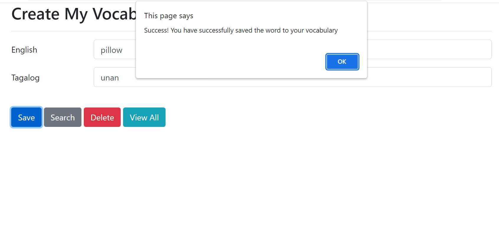
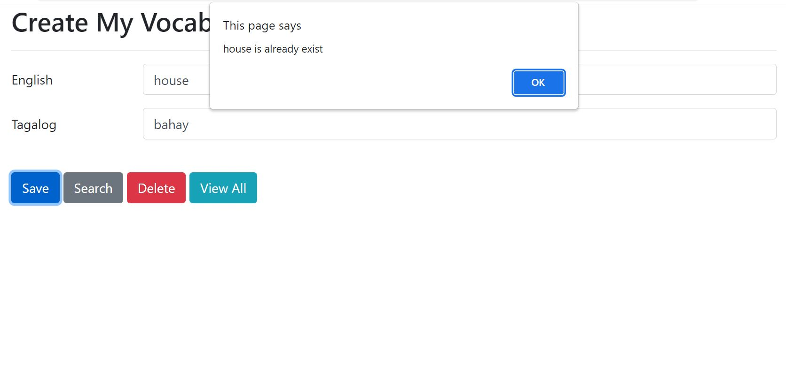
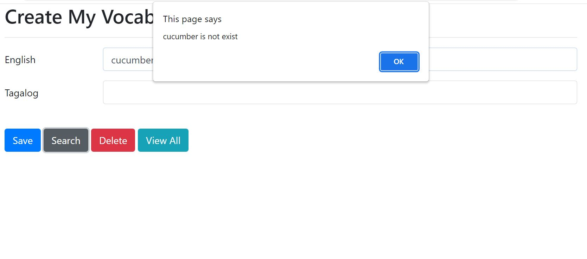
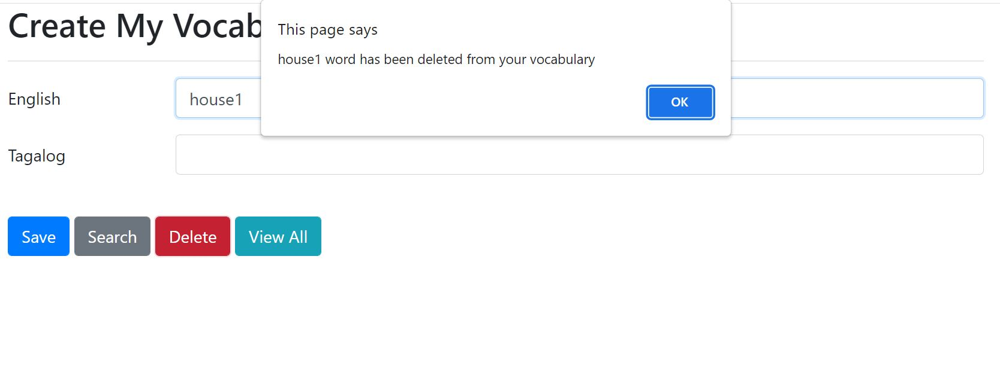
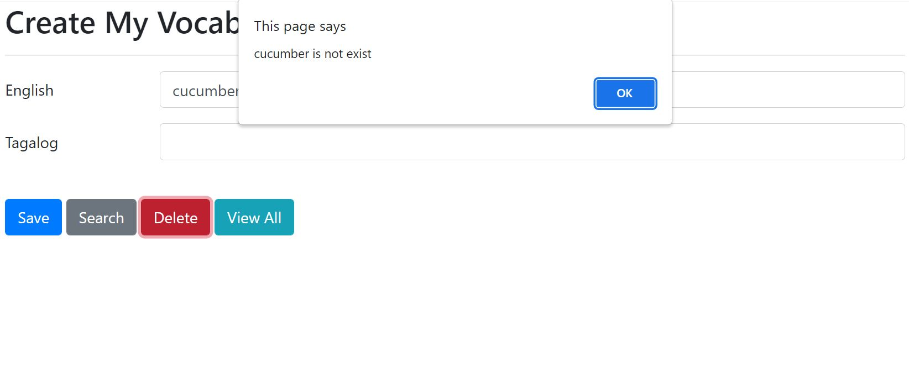
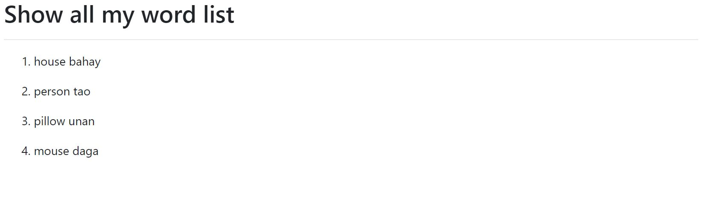

# JS Local Storage

Vocabulary (from English to Tagalog) using local storage of Javascript.
`setItem()` and `getItem()` methods are used.

### Functions
1. Save word to vocabulary
2. Search word from the vocabulary
3. Delete word from the vocabulary
4. View all words

### Technologies
1. HTML
2. Bootstrap 4
3. Javascript

### Screenshots
1. Save Success: 
  
2. Already Exist on Save: (word already exists in the vocabulary)
  
3. Not Exist on Search: (word does not exist on search)
  
4. Delete Success:
  
5. Not Exist on Delete: (word does not exist on delete)
  
6. View All Words:
  
